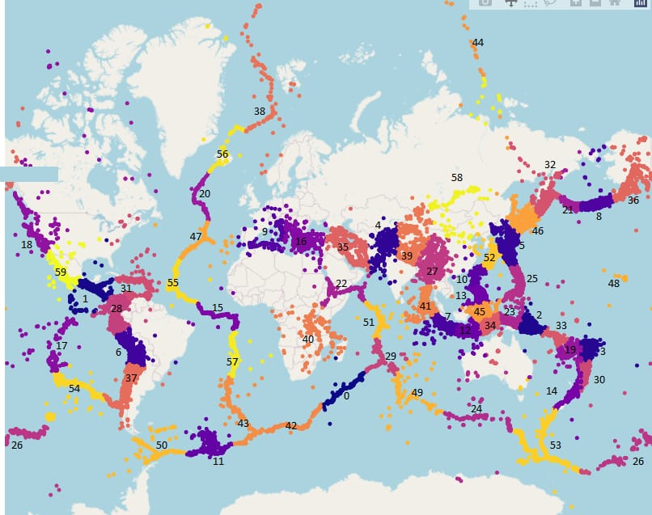
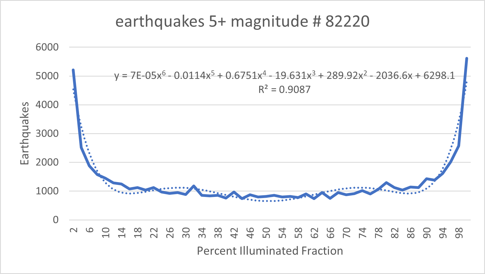
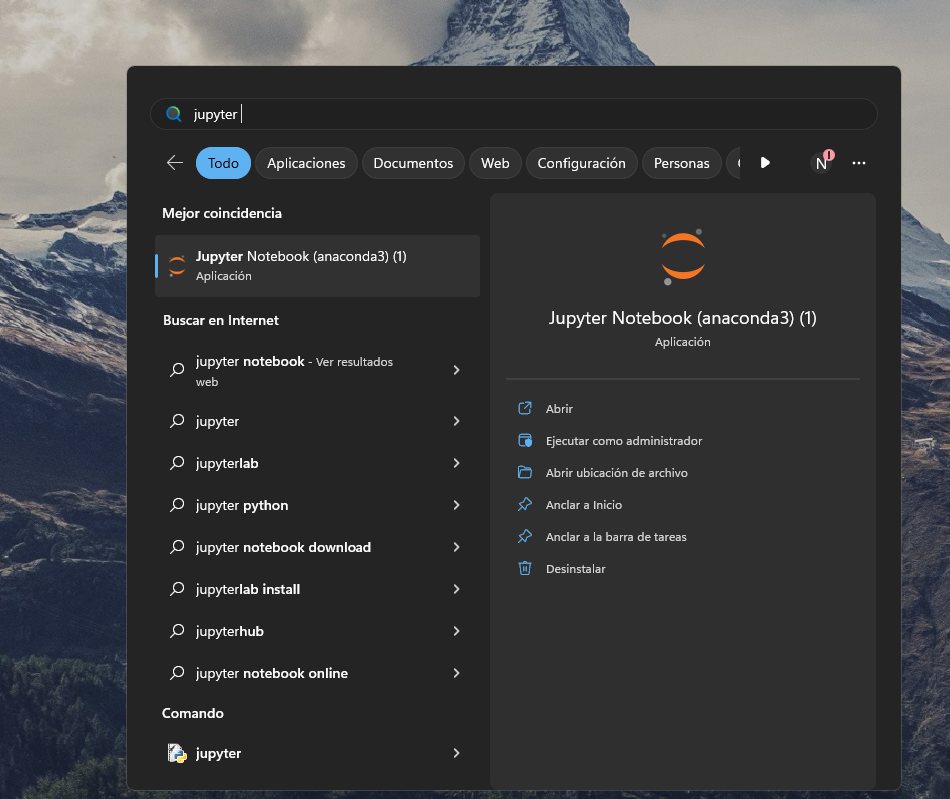
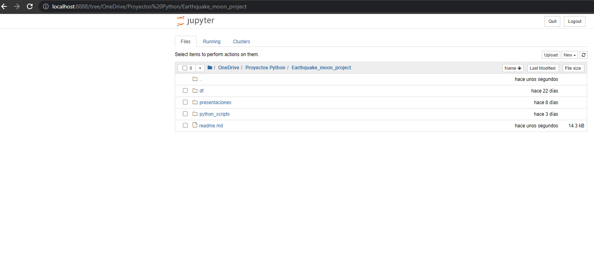
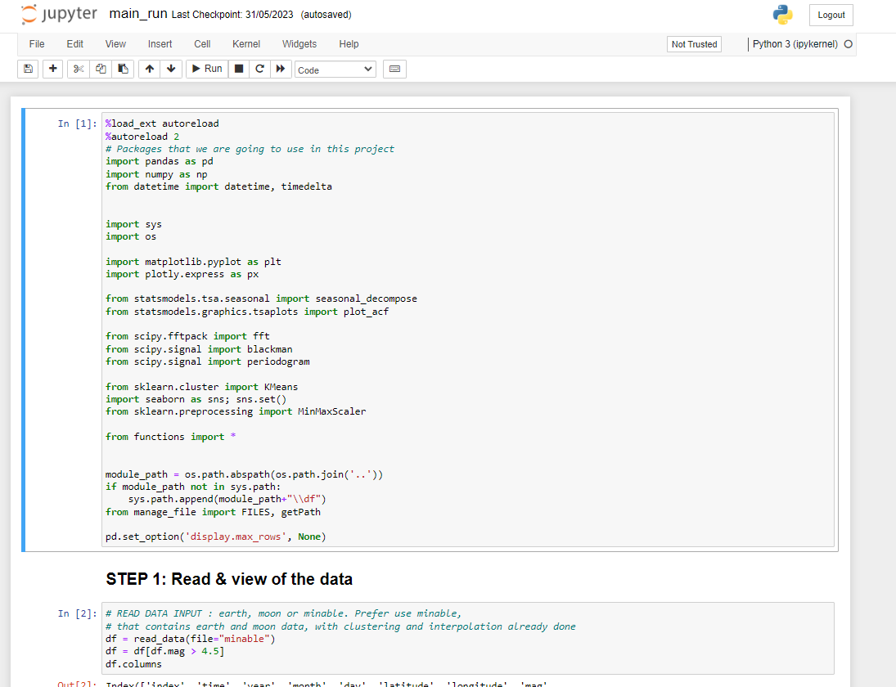

# 1.0 Earthquake_moon project

This project is designed to analyze earthquake, solar and lunar gravitational data with the option of managing different graphs, histnorms, tables, trendlines for analysis. For this we consider in the earthquake data latitude and longitude, magnitude, depth, time, periods of the year, groupings by magnitude, groupings of earthquake clusters . On the side of the moon data we take into consideration the data coming from ... and we use the fraction of illumination, declination, and distance (r/km).

We have 60 clusters, for each of them the functions described below work and allow analysis flexibility.



Robert Bostrom in Tectonic Consequences of the Earth’s Rotation notes that: 
> “ Von Helmholtz identified the species of motion (vortical) with respect to which there is no velocity potential in 1857. …, his insight has been disregarded by those of us struck by a tidal energy flux, astronomically well measured, that has seemed to “disappear” within the Earth. For scale, this is at least as great as that released in global seismicity. It may be desirable to examine the effects of actual external gravity, rather than those of a geocentric field that might well be attributed to Ptolemy. “

There is not a more perfect measurement of an “actual external gravity” than the phases of the moon. When the sun, the moon and the Earth are in syzygy , “actual external gravity” is at maximum and very well measured. It is unfortunate that 50 years of data amounts to less than 3 Earth/moon/sun perigean cycles each lasting 18.6 years. Contrast this to the well measured, almost 300 years of 25 solar cycles each lasting approximately 11 years.

Carlo Doglioni, notes in Polarized Plate tectonics, that it is an Earth’s scale phenomenology, and the energy necessary for its existence is not concentrated in limited zones (e.g., subduction zones), but it is contemporaneously distributed all over the whole Earth’s lithosphere, like the Earth’s rotation. Romashkova (2009) has recently shown how the planet seismicity indicates that the Earth’s lithosphere can be considered as a single whole. Only the global seismicity follows the Gutenberg-Richter law, while this simple relation does not hold when considering smaller portions of the Earth (Molchan, Kronrod, & Panza, 1997; Nekrasova & Kossobokov, 2006). The only mechanism that acts globally on the lithosphere and mantle is the Earth’s rotation. We also propose that the gravitational effects of the sun and the moon act globally on the Earth’s lithosphere and mantle as evidenced by this data analysis project.


<!--AND THE MOON AND SUN-->

Doglioni continues in Polarized Plate Tectonics that based on the previous discussions, the observed phenomenology 
of plate tectonics confirms mantle convection, (there are waves on the ocean thus the ocean makes waves) but it 
appears to be governed from the top, i.e., an astronomically sheared lithosphere travels westward along the TE, 
facilitated by the decoupling allowed by the presence, at the top of the asthenosphere, of a continuous global flow 
within the Earth low-viscosity LVZ that is in superadiabatic conditions (Figure 86). 
Doglioni continues with, “The tidal forces are too small to generate earthquakes within continental areas, and for 
this reason they have been disregarded for long time.” This data analysis project demonstrates clearly that the 
tidal forces of the sun and moon do generate earthquakes within continental  areas as evidenced by the illuminated
fraction graphs of the  continental clusters 58, 40, 18, 9, 16, 35, 22, 39.


For more information, the project's abstract file is available, with additional information and uses of the project.
## 2.0 Source Data

For Lunar data we employ the spreadsheet created by Jurgen Giesen, GeoAstro.de/moonpos which uses the astronomical algorithms by Jean Meeus. These algorithms provide calculations for daily lunar phase, distance and declination for any year between 1950 and 2050. 


For earthquake data we use the United States Geological Survey (USGS) database of all earthquakes on the globe Earth greater than 4,5 magnitude. To date there have been more than 264.000 earthquakes 4,5 mag and greater since the first of January 1973. This provides for a very thorough snapshot of the current state of lithosphere movement of the Earth.
## 3.0 Basic Geophysics for Beginners: how the moon and sun relate to Earthquakes
#### Peter Haney, principal investigator.
#### Nicolas Salgado, computer programmer , Biwiser Analytica, Santiago, Chile.

By looking at all the earthquakes, all the time, over the entire Earth; it was felt that it might be possible to show a relationship between the moon and sun’s gravitational effects and seismicity on Earth.  https://github.com/NicolasSalgado/Earthquake_moon_project
By juxtaposing the two data sets of global seismicity and lunar-solar data; the study permitted the data to speak for itself and the following relationship was evident:


Thus the data illustrates that the mean synodic month, from new moon to full moon and back and forth from full moon and new moon, has a strong relationship to seismicity across the entire Earth.  From 50 years of USGS data for magnitude 5 and greater earthquakes you see the above graph:  0% illumination is a new moon and 100% illumination being the full moon.

“Some scientists have also suggested that plate tectonics may be triggered by the effect of tidal variations across many hundreds of millions of years (influence of the Moon and Sun’s gravity) (Riguzzi et al., 2010; Eppelbaum and Isakov, 2015). However, there is currently no theoretical or practical methodology for testing this hypothesis.
”Pilchin, Arkady. Eppelbaum, Lev V.    https://www.researchgate.net/publication/344075980_Plate_Tectonics_and_Earth_Evolution_A_Conceptual_Review, 2020 November.


The hope is that this program can begin to provide a theoretical and practical method for testing the hypothesis of whether the sun, moon and earth are interconnected sufficiently to affect seismicity. 


## 4.0 Directory Project

```
📦 Earthquake_project
├─ df/
│  ├─ input/
│  │  ├─ earthquake.xlsx
│  │  └─ moon_data.xlsx
│  ├─ output/
│  │  └─ minable
│  └─ manage_file
└─ python_scripts
   ├─ main_run.ipynb
   ├─ NEW_EARTH_MOON_DATABASE.ipynb
   └─ functions.py
```

### 4.1 df
This folder contains the files that are used and the paths that are used later in the scripts.

In `input/` we have the `earthquakes.xlsx` and `moon_data.xlsx` files. In `output/` is contained
the `minable.csv` file that contains the final consolidation of these two sources of information.

In `manage_file.py` is a script that manages the path to then read and write to those files.
In case you want to use new files, it is recommended to leave them assigned with the names that are currently used,
but in case of changing them, the name must be changed in this file

### 4.2 python_scripts
This folder contains the python executables.

* `main_run.ipynb`: Jupyter notebook containing the main executables for testing and reviewing functionality. Runs the functions in functions.py, running data reading, filters, histograms, calculations, and others.

* `functions.py`: To simplify the amount of code that is handled from the main_run, this file is the container for functions that are executed.

* `new_database.ipynb`: In case of updating the earthquake and moon tables, this script must be run to generate the consolidated mineable again. It is important that the structure and column names are the same.

## 5.0 Variables
The variables contained in the input and output tables are the following
* Eartquake data
    
    | Variables |     |
    |-----------|-----|
    | `time`    | `id` |
    | `year`    | `updated`|
    | `month`   | `place` |
    | `day`   | `Po` |
    | `latitude`   |`Pais`|
    | `longitude`    | `type` |
    | `depth`    | `horizontalError`|
    | `mag`  | `depthError` |
    | `magType`   | `magError`|
    | `nst`   | `magNst` |
    | `gap`    | `status`|
    | `dmin` |`locationSource`|
    | `rms`   | `magSource` |
    | `net`   |  |


* Moon data
  
    | Variables |     |
    |-----------|-----|
    | `Year`    | `R/km` |
    | `Date`    | `DEC`|
    | `Month`   | `RA/h` |
    | `Day`   | `RA/°` |
    | `ill_frac`   | |
  


* Minable : is the consolidated information. Contains added PERIOD, MAG_SEG and columns
interpolated.
  
    | Variables |     |
    |-----------|-----|
    | `time`    | `NewMonth` |
    | `year`    | `cluster_label`|
    | `month`   | `acum_day` |
    | `day`   | `ill_frac` |
    | `latitude`   |`r/km`|
    | `longitude`    | `dec` |
    | `depth`    | `ra/h`|
    | `mag`  | `ra/°` |
    | `Pais`   | `ill_frac_interpolated`|
    | `PERIOD`   | `r/km_interpolated` |
    | `MAG_SEG`    | `dec_interpoalated`|
    | `NewDate` ||

## 6.0 Execution 
To execute a cell in jupyter notebook, select the cell and press CTRL + Enter.


The `main_run.ipynb` file is used to run the program. This file is executed per cell, executing the first two being a requirement for the others to make sense.
The first cell is responsible for importing the packages that will be used, and the second importing the minable data.                                                                                                      

After importing packages and reading files, there are different functions that apply changes or filters the dataframe, change labels (period, groups by magnitude, etc.),
generate histograms, plot map, trend calculations, estimated distribution, all distinguishing by cluster or filtering by some of them. All these functions have different parameters that allow checking
for different data segments or others.

Below we leave the functions used with their parameters.

1) **read_data**: Function to read the data.
   
    * Args:
        * file: (str) name of the dataset to read, by default "minable". Other options "earth", "moon".

    * Returns: (DataFrame) dataframe.
2) **filter_dataframe**: Filter the df according to a var y magnitude over a certain range.
    * Args:
        * df: Dataframe.
        * var: (str) By default "ill_frac_interpolated".  name of the column to use.
        * var_range: (tuple) By default (0,100). Range to filter the var.
        * mag_range: (tuple) By default (3,10). Range to filter the magnitude var.

    * Returns: Filtered Dataframe.

3) **period_calculations**: Create the period group column.
   * Args:
        *df: Dataframe with data.
        * period_length: PERIOD in years to generate the grouping.

    * Returns: Dataframe with column PERIOD generated.

4) **magnitude_segmentation**:  Create the  MAG_SEG group column.
    * Args:
        * df: (DataFrame) dataframe to use.
        * mag_seg: Magnitudes groups to label each earthquake.

    * Returns: Dataframe with MAG_SEG column generated according to the mag_seg.

5) **histogram monthly**: Create a histogram plot grouped by month.
    * Args:
        * df: Dataframe.
        * date_off_set: Boolean(True,False), by default False.
        * bool_mag_seg: Boolean(True, False), by default True.

    * Returns: None.

6) **plot_monthly**: Bar plot monthly over a period of years.
    * Args:
        * df: Dataframe.
        * years: (tuple). (Year beginning, Year end).

    * Returns: None.

7) **countries_value_counts**: Calculate number of earthquake by country.
    * Args:
        * df: Dataframe.

    * Returns: None.

8) **histogram_countries**: Create an histogram plot grouped by the countries given.
    * Args:
        * df: Dataframe.
        * countries: (list)[] countries to show in the histogram.

    * Returns: None.

9) **plot_map** : Plot map distinguish by cluster and specific clusters.
    * Args:
        * df: Dataframe.
        * clusters: (Boolean) By default False. Whether to color earthquakes by cluster or not.
        * specific_clusters:(List) By default None. Clusters to filter.

    * Returns: None

10) **trendline_calculations**: Trendline calcualtions for PERIOD label.
    * Args:
        * df: Dataframe.
        * cluster: (boolean). Whether to do the calculation by cluster or not.

    * Returns:trendline results

11) **plot_map_animation**: Plot map  enable to frame by column (year by default) and specifics clusters.
    * Args:
        * df: Dataframe.
        * specific_clusters: (list ) By default None. List of clusters to filter.
        * animation_frame: column name to execute the frame.

    * Returns: None

12) **specific_cluster_info**: Gives information of trend and proportion of an specific cluster.
    * Args:
        * df: Dataframe.
        * cluster: (int) Cluster label.

    * Returns: None.

13) **histogram_cluster**: Create an histogram plot filtered by clusters given.
    * Args:
        * df: Dataframe.
        * clusters: (list) [] name of countries to filter.

    * Returns: None.


14) **histogram_overtime**: Histogram plot with animation frame over a column. By default over year.
    * Args:
        * df: Dataframe.
        * var: name of the column to use.
        * specific_cluster: (int) By default None. Whether to filter by a cluster.
        * animation_frame: (str) By default "year". Label of column to frame.

    * Returns: None

15) **describe_columns**: Computes descriptive statistics of each column in a pandas DataFrame.
    
    * Args:
        * df (pandas.DataFrame): A pandas DataFrame object.
        * columns (list): list of columns.
        * step_quantile (float): The step between each quantile to compute. Default is 0.25.
        * clusters (list): list of clusters of interest.
    
    * Returns:
        * (pandas.DataFrame): A DataFrame object containing the computed statistics for each column.

16) **calculo_distribution**: Calculates the proportion of earthquakes given a range.
    * Args:
        * df: Dataframe.
        * var: (str) name of the column to use.
        * num_bins: Number of bins to create.
        * specific_cluster: None by default. Number of cluster label to filter.

    * Returns: None

17) **distribution_plot**: Plot of kernel density estimate of a certain variable. In case you input two datframes to compare, make sure that the first one be earthquake data and the second one moon data.
    * Args:
        * df: Dataframe. Minable, consolidated earthquake and moon.
        * df1: Dataframe. By default None. Moon database
        * var: column to calculate. By default "ill_frac_interpolated".
        * specific_cluster: (int) By default None. Whether to filter by a cluster.

    * Returns: None.

18) **plot_calculo_distribution**: Histogram plot to the proportion distribution calcualted for certain number of bins.
    * Args:
        * df: Dataframe
        * var: (str) name of the column to use.
        * histnorm: (str). By default "percent". How to calcualte y-axis.
        * num_bins: (int). By default 10. Number of bins.
        * specific_cluster: (int) By default None. Whether filter for specific cluster.

    * Returns: None.

19) **histogram_animation**: Histogram plot over a var with animation frame.
    * Args:
        * df: Dataframe.
        * var: (str) By default "ill_frac_interpolated".  name of the column to use.
        * nbins: (int). By default None. Number of bins.
        * histnorm: (str). By default "percent". How to calcualte y-axis.
        * animation_frame: (str) By default "year". Label of column to frame.
        * range_x: (tuple) By default None. If None use range by default, if you give a tuple use the tuple.
        * range_y: (tuple) By default None. If None use range by default, if you give a tuple use the tuple.

    * Returns: None.


20) **count_number_days**: Calculate the number of days that a certaing variable (moon data) is in a range.
    * Args:
        * var: (str) By default "r/km". Column to use.
        * range_var: list. Range to use.

    * Returns:None

21) **filter_by_date**: Filter dataframe over a initial date and a number of weeks ahead.
    * Args:
        * df: Dataframe.
        * date_filt: (str) By default "2020-05-03". Format "YYYY-MM-DD".
        * nweeks: (int) By default 4.Number of weeks.

    * Returns: filtered dataframe.
    
    
## 7.0 Requirments
Computational requirements

- Download Python 3.8 or higher
- Jupyter Notebook

It is recommended to use the Anaconda *https://www.anaconda.com/download* distribution that contains Python, Jupyter and the libraries used in the program.
Otherwise, the two requirements listed above would need to install the packages used.

Here is a guide to installation of anaconda *https://docs.anaconda.com/free/anaconda/install/windows/* 

After the installation, you should have on your computer all the requirements to run the project.
Write in the search engine of the operating system "jupyter notebook".


After selecting the application a terminal will open and later in the web browser a local page where by searching your
file directory you will be able to find the project and open main_run.



Where finally the cells and functions previously described can be executed pressing CTRL + ENTER.
